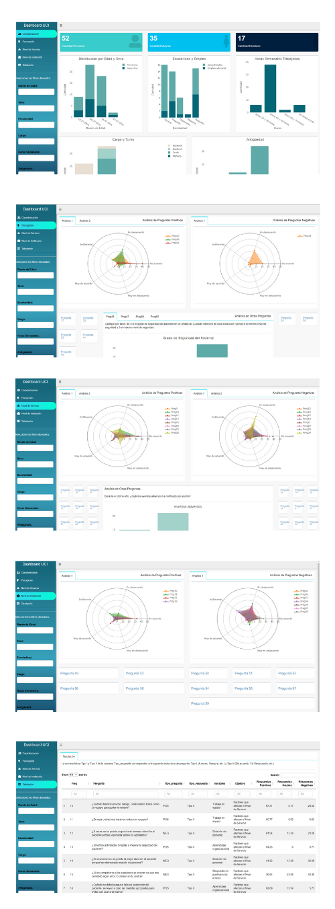

# dashboardSalud

## Check It Out

- Try a demo of the app on [shinyapps.io][app-shinyapps]

## App Secctions

This dashboard aims to present in an organized way the results obtained from a survey conducted in an Intensive Care Unit in Colombia. This analysis seeks to determine a strategy to guarantee the safety of the patient within the area and to determine what type of factors influence to increase the risk of the patient in the hospital.

The filter section on the left allows the user to filter the information that is presented in each part of the board.

Currently, the dashboard includes the following tabs and features:

- &#x1f46b; **Caracterización** 

    The characterization corresponds to the responses obtained from 52 people who currently work for an Intensive Care Unit (UCI) in Colombia. This section of the application contains all the descriptive graphs related to the characteristics of these people, analyzing different aspects in an aggregate manner. 

    The information contained additionally contains some labels in the upper part that facilitate the analysis of each filter that is carried out with the fields that appear in the lower left part of the app.
    
- &#x1F3C6; **Percepción** 

    This section looks at some questions regarding the ICU staff's perception of the safety of the patient being cared for in the area. The answers are grouped into questions formulated positively and negatively. Similarly, all the filters that have directly affected the results in the application.
    
    Perception is not only analyzed with multiple choice questions, but a section of open-ended questions was added so that respondents could place suggestions and comments about patient safety within the ICU.

- &#x1f6ce; **Nivel de Servicio** 

    Service Level corresponds to the variables that affect patient safety within the ICU and that are directly related to the service provided there.

    Similarly to the previous section, here is evidence from different aspects of the specific perception of the service that the ICU currently provides.

- &#127973; **Nivel de Institución** 

    This section is another of the fundamental objectives of the survey carried out. To measure the perception of the health personnel according to the aspects that directly affect the medical institution as such. 

    The analysis is done in terms of relationship, work environment and communication between the different areas of the hospital and that directly affect the functioning of the ICU.

- &#x1f4cb; **Tabulación** 

    Finally this section tabulates all the results obtained within the different objectives mentioned above, the user has the possibility to filter specific objectives, questions either by the number of the question or by keywords that appear within it.

    On the other hand, the proportion of answers that had positive, neutral or negative answers is quantified.    

## &#x1F64F; Thank you!

This dashboard was built using many great tools in the R ecosystem. Thanks to all of the developers of these open source packages:

- [shiny]
- [shinydashboardthemes]
- [shinydashboard]
- [plotly]
- [tidyverse]
- [shinyWidgets]
- [DT]
- [wordcloud2]
- [text2vec]

---

This dashboard was built by [Alejandro Cano][Alejandro-Cano]

Any comments about this application are welcome!! Bye &#x1f60e; Bye 

[Alejandro-Cano]: https://www.linkedin.com/in/mauricioacano/
[app-shinyapps]: https://mauriciocano.shinyapps.io/DashboardSalud/
[shiny]: http://shiny.rstudio.com/
[shinydashboardthemes]: https://github.com/nik01010/dashboardthemes
[shinydashboard]: https://rstudio.github.io/shinydashboard/
[plotly]:https://plot.ly/
[tidyverse]: https://tidyverse.org
[shinyWidgets]: https://github.com/dreamRs/shinyWidgets
[DT]: https://rstudio.github.io/DT/
[wordcloud2]: https://github.com/Lchiffon/wordcloud2  
[text2vec]: https://github.com/dselivanov/text2vec

